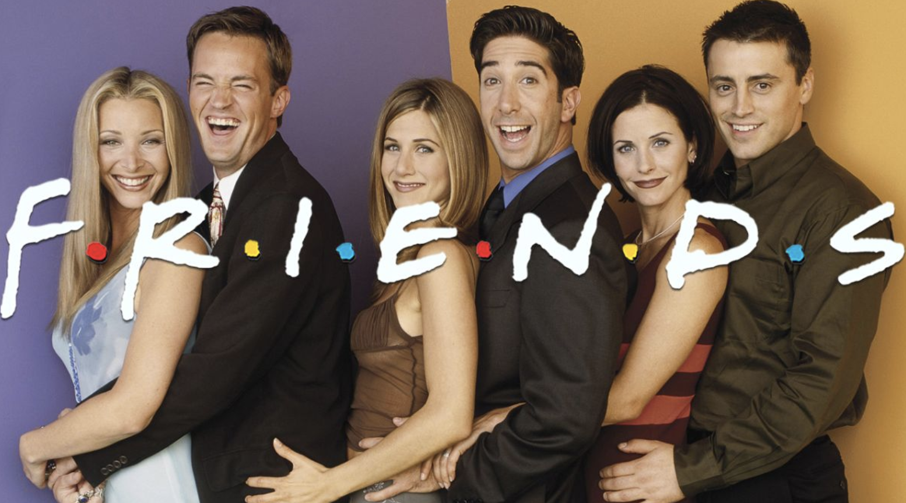

# Overview

NLP Friends is a conversational bot using transformer introduced in "Attention is all you need" Aswani et al, with word2vec for word embedding.
Friends script is acquired from [emorynlp](https://github.com/emorynlp/character-mining).

# Prerequesites
The program requires python/python3 and the following packages.
``` bash
pip install pytorch
pip install tensorboard
pip install nltk
pip install matplotlib
```
In addition to installing nltk, it may be required to download nltk data, called punkt. To download, open python and type the following.
``` python
>>> import nltk
>>> nltk.download()
```

# Run
## Main Flow of the Program
### Setting Threshold for Vocabulary
It becomes computationally overwhelming if one does not truncate vocabulary. A file at loader/preprocessor_visual.py can resolves the issue by graphing the size of vocabulary as threshold increases. Words which does not pass the threshold will be regarded as None (similar to <unk> token).
``` bash
python loader/preprocessor_visual.py
```
### Pretrain word embeddings
Hyperparameters such as epochs or learning rate can be adjusted in pretrain.py. Then, run the file to pretrain word embeddings.
``` bash
python pretrain.py
```
### Train lanuage translation model
Hyperparameter adjustment is done similarly to the previous step. Then, run train.py to train translation model.
``` bash
python train.py
```
### Check Pretrain/Train results
Tensorboard allows to visualize including loss, graph, and embeddings. 
When either pretrain or train step is finsihed, run tensorbard.
``` bash
tensorboard --logdir=runs
```
### Play
Once trained and pretrained models are created, run main.py to start a conversation.
``` bash
python main.py
```

# Cherry picked results
The file 'result/train_0112_1.pt' seems to be trained well. 
Due to the computation complexity, train data was limited to the first episode of season one.
To try yourself, change a file path in main.py
```
load = torch.load('result/train', torch.device('cpu')) ->
load = torch.load('result/train_0112_1.pt' torch.device('cpu')
```

Here is some outcome.

``` 
Welcome to Friends chat bot
***************
PRETRAIN SETTING


TRAIN SETTING
***************
YOU: hello!
COM: hi , paul , is it ?
YOU: yeah i am paul.
COM: yeah . yeah , i 'm an idiot .
YOU: don't call yourself that
COM: yeah ... yeah , i 'm an idiot .
YOU: actually, i am not paul
COM: oh , god monica 's just ... i 'll just want that 's just stay here with monica .
YOU: who is monica?
COM: well , maybe that 's my decision . well , maybe i was back in your money . wait . wait . wait . wait .
YOU: good morning
COM: morning .
YOU: how are you?
COM: oh , i 'm pushing my aunt i was back in high school , i just got ta go of my aunt i was back in the room where we were
YOU: where is mom and dad?
COM: oh no , no , i 'm sorry .
```


# Limitation
Here are some limitations in the project.
* I find loss for word embeddings with word2vec is still very high range (around 4.0) and time consuming to train.
* Absence of GPU training. <br>
cuda is not available in my MacBookPro, so I did not bother to code for GPU accessible machines.
* Greedy decoding seems to be very limited. Beam search should provide a better result.
* Absence of information of what character in Friends gives the response. (I believe this can be solved with character tag and including as feature).
* Program cannot maintain the topic of conversation. Simply a one line reply what user type.

